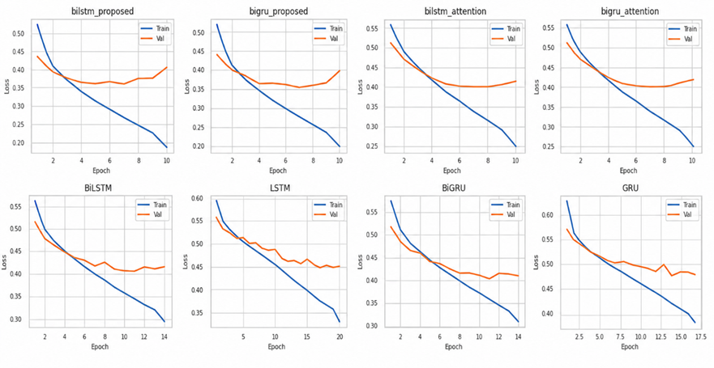
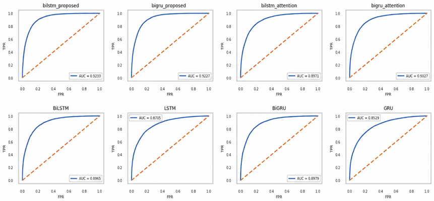

<h1 align="center">Semantic Similarity with Attention</h1>

<p align="center">
  <em>A Siamese BiLSTM encoder with additive attention pooling and multi metric distance fusion for sentence pair semantic matching.</em>
</p>

<p align="center">
  
  
  
  
  
  
</p>

---

## TL;DR

Two sentences can mean the same thing while sharing almost no words:

```text
A: "How do I reset my password?"
B: "I forgot my password. How can I change it?"
```

Lexical overlap says *different*, but intent says *same*. This project closes that gap with a Siamese network that encodes each sentence using a shared BiLSTM with additive attention pooling, then compares the two resulting vectors through three complementary distance geometries at once: angular (cosine), city block (Manhattan), and straight line (Euclidean).

The best configuration reaches **F1 0.8305** and **accuracy 0.8465**, an improvement of **3.3 points of F1** over the same BiLSTM encoder without distance fusion, while converging in 10 epochs instead of 14. Across eight trained variants the evidence points clearly to the distance fusion as the component doing the work.

The cost of that fusion is **192 trainable parameters**, an increase of 0.0155 percent, and the model reaches its result with 1.24 million trainable weights against the 109.6 million of BERT base. Section 5 documents both findings in detail.

---

## 1. Architecture

<p align="center">
  
</p>

<p align="center"><em>Figure 1. Proposed model architecture.</em></p>

The diagram traces a single sentence pair through the network. Both sentences enter separate input layers but pass through identical shared components, so the two branches are mirror images of each other rather than independent encoders. The paths only diverge at the point where their pooled vectors are compared, and from there a single fused representation carries forward to the prediction layer.

```text
q1 (70 tokens) ──┐                                              ┌──► v1 (512) ──┐
                 ├─► Embedding (frozen, pretrained) ─► BiLSTM ──┤               ├─► d_cos, d_man, d_euc
q2 (70 tokens) ──┘   shared weights          256 units, shared  └──► v2 (512) ──┘        │
                                             return_sequences                            │
                                                     │                                   │
                                          Additive Attention (64)  ◄───────────────┐     │
                                          shared, sequence to vector               │     │
                                                                                   ▼     ▼
                                              Concat [ v1 ‖ v2 ‖ d_cos ‖ d_man ‖ d_euc ]  (1027)
                                                                  ↓
                                              Dense 64 → Dropout 0.3 → Dense 32 → Dropout 0.3
                                                                  ↓
                                                      Dense 1, sigmoid → P(similar)
```

Every component, including the embedding, the BiLSTM, and the attention layer, is **shared** between the two branches. That is what makes the network Siamese: both sentences are projected by the same function into a single comparable space, so the distances computed downstream are meaningful.

### Configuration

| Component | Setting |
| :--- | :--- |
| Sequence length | 70 tokens, padded and truncated |
| Embedding | Pretrained 300 dimensional matrix, vocabulary 84,637, **frozen** (`trainable=False`) |
| Encoder | `Bidirectional(LSTM(256, return_sequences=True))`, 512 dimensions per token |
| Attention | Additive (Bahdanau), 64 hidden units, produces a 512 dimensional sentence vector |
| Fusion input | `[v1 ‖ v2 ‖ d_cos ‖ d_man ‖ d_euc]`, 1027 dimensions |
| Classifier | Dense 64 (ReLU) → Dropout 0.3 → Dense 32 (ReLU) → Dropout 0.3 → Dense 1 (sigmoid) |
| Loss and optimizer | Binary cross entropy, Adam at learning rate 1e-4 |
| Early stopping | Patience 3, best weights restored |

Freezing the embedding is a deliberate trade. The model cannot adapt word vectors to the task, but it also cannot overfit them, and every trainable parameter goes into the encoder and the comparison head instead.

---

## 2. Additive Attention Pooling

The BiLSTM emits one hidden state per token, written $H = [h_1, \ldots, h_T]$ with $h_t \in \mathbb{R}^{512}$. A sentence level decision needs a single vector, so the sequence must be collapsed. Mean pooling would weight a stopword the same as the head noun, so this layer learns the weights instead.

Additive attention, in the Bahdanau formulation, scores each token, normalises the scores over time, and returns their weighted sum:

$$
e_t = v^{\top} \tanh(W h_t + b)
$$

$$
\alpha_t = \frac{\exp(e_t)}{\sum_{j=1}^{T} \exp(e_j)}
$$

$$
c = \sum_{t=1}^{T} \alpha_t \, h_t
$$

| Symbol | Shape | Role |
| :--- | :--- | :--- |
| $h_t$ | $\mathbb{R}^{512}$ | BiLSTM hidden state at position $t$ |
| $W, b$ | $\mathbb{R}^{512 \times 64}$, $\mathbb{R}^{64}$ | Projects each token into the attention space |
| $v$ | $\mathbb{R}^{64}$ | Learned global query, a single vector shared across all sentences |
| $\alpha_t$ | scalar | Relevance of token $t$, with $\sum_t \alpha_t = 1$ |
| $c$ | $\mathbb{R}^{512}$ | Sentence representation |

### What this mechanism does

The vector $v$ acts as one learned query that asks the same question of every sentence: which tokens carry the meaning? Each token is scored independently against that query. This makes the layer a learned pooling operation, and it behaves differently from the scaled dot product attention used in Transformers.

| | Additive attention pooling (this model) | Scaled dot product self attention |
| :--- | :--- | :--- |
| Query source | One learned vector $v$, fixed for all inputs | Every token queries every other token |
| Output per input | One weight per token, giving $\alpha \in \mathbb{R}^{T}$ | One weight per token pair, giving a $\mathbb{R}^{T \times T}$ matrix |
| Models token to token interaction | No | Yes |
| Role in the network | Learned pooling, replacing mean or max | Contextual re encoding |
| Parameters | $512 \times 64 + 64 + 64 + 1 = 32{,}897$ | $4d^2$ per layer for Q, K, V, O |

The consequence for interpretation is that the attention output is a one dimensional vector of token importances, one weight per token. It is visualised as the sentence with each token shaded by its weight, which is the natural reading for a mechanism that ranks tokens rather than pairing them.

---

## 3. Distance Fusion

Given the two pooled representations $u = v_1$ and $w = v_2$, the model computes three distances. All three are distances rather than similarities, so **lower always means more similar**, which keeps the sign convention consistent for the classifier.

### 3.1 Cosine distance, measuring direction

$$
d_{\cos}(u,w) = 1 - \frac{u \cdot w}{\lVert u \rVert \, \lVert w \rVert}
$$

This captures angular disagreement between the two vectors and is invariant to their magnitude. It is bounded in $[0, 2]$, which makes it stable, but it cannot see how strongly a feature is expressed.

### 3.2 Manhattan distance, measuring per dimension disagreement

$$
d_{\text{man}}(u,w) = \log\!\left(1 + \sum_{i=1}^{512} \lvert u_i - w_i \rvert\right)
$$

This is the sum of absolute differences. Because it never squares the residuals, it stays sensitive to many small mismatches rather than being dominated by one large one.

### 3.3 Euclidean distance, measuring overall displacement

$$
d_{\text{euc}}(u,w) = \log\!\left(1 + \sqrt{\sum_{i=1}^{512} (u_i - w_i)^2 + \varepsilon}\right), \qquad \varepsilon = 10^{-8}
$$

This is straight line geometric distance. Squaring makes it the opposite of Manhattan in temperament, since a single badly mismatched dimension dominates the score. The $\varepsilon$ term keeps the gradient of the square root finite when the two vectors coincide, which prevents `NaN` values during backpropagation on identical sentence pairs.

### Why the logarithm

Raw L1 distance over 512 dimensions can reach the hundreds, while cosine distance never exceeds 2. Fed into the same Dense layer, the unscaled distances would dominate purely through magnitude. The $\log(1+d)$ transform compresses them onto a comparable range and is monotonic, so the ordering that each metric encodes is preserved exactly.

### 3.4 Fusion and prediction

$$
m = \left[\, v_1 \;\Vert\; v_2 \;\Vert\; d_{\cos} \;\Vert\; d_{\text{man}} \;\Vert\; d_{\text{euc}} \,\right] \in \mathbb{R}^{1027}
$$

$$
\hat{y} = \sigma\Big(W_3 \cdot \text{drop}\big(\text{ReLU}(W_2 \cdot \text{drop}(\text{ReLU}(W_1 m)))\big)\Big)
$$

The classifier is free to learn how much to trust each geometry rather than having fixed weights imposed by hand.

| Distance | Sensitive to | Parameter cost |
| :--- | :--- | ---: |
| Cosine | Orientation only | 0 |
| Manhattan | Many small differences | 0 |
| Euclidean | A few large differences | 0 |

All three are parameter free operations. The entire fusion hypothesis costs three extra input features and zero weights, which is what makes the gain reported in Section 5 notable.

---

## 4. Experimental Setup

Eight models were trained under identical conditions so that each architectural component could be isolated. They form two families, one built on LSTM and one on GRU, and within each family the models form a ladder of four increasing levels of capability.

| Level | Model | Description |
| :--- | :--- | :--- |
| 1 | `LSTM`, `GRU` | Unidirectional recurrent encoder, last hidden state |
| 2 | `BiLSTM`, `BiGRU` | Bidirectional encoder, reads the sentence in both directions |
| 3 | `BiLSTM + Attention`, `BiGRU + Attention` | Adds additive attention pooling over the sequence |
| 4 | `BiLSTM + Attention + Fusion`, `BiGRU + Attention + Fusion` | Adds the three distance measures, the proposed model |

Because each level differs from the one below it by exactly one component, the difference in results between two adjacent levels can be attributed to that component alone.

---

## 5. Results

### 5.1 Predictive Performance

| Model | Accuracy | Precision | Recall | F1 |
| :--- | ---: | ---: | ---: | ---: |
| **BiLSTM + Attention + Fusion** | **0.8465** | **0.8055** | 0.8571 | **0.8305** |
| BiGRU + Attention + Fusion | 0.8433 | 0.7950 | **0.8659** | 0.8289 |
| BiGRU + Attention | 0.8236 | 0.7778 | 0.8369 | 0.8063 |
| BiGRU | 0.8182 | 0.7845 | 0.8070 | 0.7956 |
| BiLSTM | 0.8178 | 0.7780 | 0.8181 | 0.7975 |
| BiLSTM + Attention | 0.8145 | 0.7638 | 0.8355 | 0.7980 |
| LSTM | 0.7907 | 0.7521 | 0.7797 | 0.7657 |
| GRU | 0.7715 | 0.7392 | 0.7402 | 0.7397 |

The two proposed models occupy the top two positions on every metric except recall balance, and they are separated from the rest of the field by a clear margin. `BiLSTM + Attention + Fusion` achieves the highest accuracy, precision, and F1, while `BiGRU + Attention + Fusion` achieves the highest recall at 0.8659. The gap between the proposed models and the strongest configuration without fusion is roughly 2.4 points of F1, which is larger than the gap separating any other two adjacent rows in the table.

One pattern holds across all eight models without exception: recall is higher than precision. The model is more inclined to declare a pair similar than to declare it different, which means the errors it makes are predominantly false positives. For an application where a wrong match is more costly than a missed one, raising the decision threshold above 0.5 would trade recall for precision and is worth tuning on the validation set.

<p align="center">
  
</p>

<p align="center"><em>Figure 2. Performance comparison across all eight trained models.</em></p>

The chart makes the grouping visible at a glance. The two fusion models sit together at the top, the four intermediate configurations form a tightly packed middle band where the differences are small enough to fall within normal run to run variation, and the two unidirectional models trail well behind. The visual separation between the top group and the middle band is the central result of this project.

### 5.2 Training Efficiency

| Model | Best epoch | Total epochs | Time | Time per epoch | Val Loss |
| :--- | ---: | ---: | ---: | ---: | ---: |
| BiLSTM + Attention + Fusion | 7 | 10 | 2390 s | 239 s | 0.3631 |
| BiGRU + Attention + Fusion | 7 | 10 | 2240 s | 224 s | **0.3571** |
| BiLSTM + Attention | 7 | 10 | 2190 s | 219 s | 0.4069 |
| BiGRU + Attention | 8 | 11 | 2310 s | 210 s | 0.4044 |
| BiLSTM | 11 | 14 | 2870 s | 205 s | 0.4079 |
| BiGRU | 11 | 14 | 2700 s | 193 s | 0.4064 |
| LSTM | 17 | 20 | 2730 s | 137 s | 0.4501 |
| GRU | 14 | 17 | 2193 s | 129 s | 0.4145 |

Best epoch is the epoch whose weights were restored by early stopping, and total epochs is how long training actually ran before patience expired. The consistent gap of three between the two columns confirms that every model stopped through the same patience setting rather than hitting an epoch ceiling.

The validation loss column separates the models more sharply than the accuracy table does. Both fusion models land near 0.36, while every other configuration sits between 0.40 and 0.45. Since validation loss measures the quality of the predicted probabilities rather than performance at a single threshold, this gap indicates that the fusion models are not merely classifying more pairs correctly but are more confident and better calibrated when they do.

The efficiency result is worth stating plainly. The proposed BiLSTM model is more expensive per epoch than the plain BiLSTM, at 239 seconds against 205, because the three distance computations and the wider concatenation add work to every step. However it converges in 10 epochs rather than 14, so total training time falls from 2870 seconds to 2390 seconds, a saving of 480 seconds. The proposed model is therefore both more accurate and cheaper to train overall, which is an unusual combination and a point in favour of the design.

<p align="center">
  
</p>

<p align="center"><em>Figure 3. Training and validation loss across epochs.</em></p>

The curves show a smooth descent without the oscillation that would indicate too high a learning rate, which is consistent with the conservative setting of 1e-4 combined with a frozen embedding. The validation curve reaches its minimum around epoch 7 and then flattens and begins to rise, and it is that turning point that early stopping detects. The distance between the training and validation curves at the point of stopping stays narrow, suggesting the dropout of 0.3 in the classifier head is doing enough regularisation for this model size.

### 5.3 Component Contribution

Reading each family as a ladder shows where the improvement actually comes from.

**LSTM family**

| Step | F1 | Change in F1 | Val Loss | Change in Val Loss |
| :--- | ---: | ---: | ---: | ---: |
| LSTM | 0.7657 | | 0.4501 | |
| BiLSTM | 0.7975 | +3.18 pt | 0.4079 | 0.0422 lower |
| BiLSTM + Attention | 0.7980 | +0.05 pt | 0.4069 | 0.0010 lower |
| BiLSTM + Attention + Fusion | 0.8305 | **+3.25 pt** | 0.3631 | **0.0438 lower** |

**GRU family**

| Step | F1 | Change in F1 | Val Loss | Change in Val Loss |
| :--- | ---: | ---: | ---: | ---: |
| GRU | 0.7397 | | 0.4145 | |
| BiGRU | 0.7956 | +5.59 pt | 0.4064 | 0.0081 lower |
| BiGRU + Attention | 0.8063 | +1.07 pt | 0.4044 | 0.0020 lower |
| BiGRU + Attention + Fusion | 0.8289 | **+2.26 pt** | 0.3571 | **0.0473 lower** |

Two components deliver most of the value, and they are not the two that might be expected.

Bidirectionality produces a large gain in both families, worth 3.18 points of F1 for LSTM and 5.59 for GRU. Reading the sentence in both directions lets every token see the words that follow it, which matters a great deal for questions where the decisive word arrives late.

Attention pooling on its own produces almost nothing. It adds 0.05 points of F1 in the LSTM family and 1.07 in the GRU family, and it moves validation loss by 0.001 and 0.002 respectively, which is within noise. In the LSTM family it even lowers accuracy slightly, from 0.8178 to 0.8145. A reasonable explanation is that the bidirectional encoder already concentrates the relevant information into its final states, so a learned weighting of the sequence has little left to recover.

Distance fusion produces the second large gain, worth 3.25 points of F1 in the LSTM family and 2.26 in the GRU family, and it cuts validation loss by more than forty times what attention alone achieved. This is the clearest finding in the study. Attention pooling on its own is close to inert here, but it becomes valuable once the pooled vectors are compared through explicit geometry, because the fusion layer needs a well formed sentence vector to compute distances from. The two components are worth keeping together even though only one of them shows an effect in isolation.

### 5.4 Discrimination and ROC-AUC

<p align="center">
  
</p>

<p align="center"><em>Figure 4. ROC curve and AUC for the proposed model.</em></p>

The curve bows toward the top left corner, meaning the model separates similar from dissimilar pairs well across the whole range of thresholds rather than only at the default cut off of 0.5. This is the appropriate metric for a ranking task, because it measures how reliably any similar pair scores above any dissimilar pair. Given the imbalance between precision and recall noted in Section 5.1, the ROC curve is also the practical tool for choosing an operating point, since the threshold that maximises F1 is rarely exactly 0.5.

### 5.5 Interpretability

<p align="center">
  
</p>

<p align="center"><em>Figure 5. Learned token importances for an example sentence pair.</em></p>

The visualisation shows how the attention layer distributes its weight across the sentence. Content words that carry the intent of the question receive noticeably more weight than function words, which indicates the layer has learned a sensible notion of which tokens matter rather than spreading attention uniformly. Comparing the two sentences of a pair side by side is the most informative view, since a well behaved model should concentrate on words that correspond across the pair, such as *reset* against *change* and *password* against *password*.

Read alongside Section 5.3, this figure also explains something the numbers alone do not. The attention layer is clearly learning something interpretable, yet on its own it barely improves the score. Its contribution is to shape a sentence vector that the distance layer can then use productively.

### 5.6 Model Complexity

| Model | Total Parameters | Trainable | Non trainable | F1 |
| :--- | ---: | ---: | ---: | ---: |
| GRU | 25,854,589 | 463,489 | 25,391,100 | 0.7397 |
| LSTM | 25,996,413 | 605,313 | 25,391,100 | 0.7657 |
| BiGRU | 26,315,901 | 924,801 | 25,391,100 | 0.7956 |
| BiGRU + Attention + Fusion | 26,348,798 | 957,698 | 25,391,100 | 0.8289 |
| BiLSTM | 26,599,549 | 1,208,449 | 25,391,100 | 0.7975 |
| BiLSTM + Attention | 26,632,446 | 1,241,346 | 25,391,100 | 0.7980 |
| **BiLSTM + Attention + Fusion** | 26,632,638 | **1,241,538** | 25,391,100 | **0.8305** |
| SBERT | 22,764,737 | 22,764,737 | 0 | |
| BERT (bert-base-uncased) | 109,582,913 | 109,582,913 | 0 | |

The frozen embedding accounts for 25,391,100 parameters in every recurrent model, which is a vocabulary of 84,637 words at 300 dimensions each. That single component makes up 95.3 percent of the total parameter count, so although the models appear to have around 26 million parameters, fewer than 5 percent of them are actually learned during training. Total parameter count is therefore a misleading basis for comparison here, and the trainable column is the one that reflects the real capacity of each model.

**The most striking number in this table is the cost of the fusion layer.** Moving from `BiLSTM + Attention` to `BiLSTM + Attention + Fusion` raises the trainable count from 1,241,346 to 1,241,538, a difference of exactly **192 parameters**, or 0.0155 percent. Those 192 weights are simply the three extra distance features connecting into the 64 unit Dense layer, since the distance computations themselves have no weights at all. For that cost the model gains 3.25 points of F1 and reduces validation loss by 0.0438.

The contrast with bidirectionality sharpens the point. Upgrading from `LSTM` to `BiLSTM` costs 603,136 additional trainable parameters and returns a comparable 3.18 points of F1. Measured as parameters spent per point of F1 gained, the distance fusion is roughly **3,200 times more efficient** than the structural change that is normally considered the obvious upgrade. This is the strongest quantitative argument the study produces in favour of the proposed design.

The comparison against transformer baselines closes the picture. SBERT trains 22,764,737 parameters and BERT base trains 109,582,913, which are 18 times and 88 times the trainable capacity of the proposed model respectively. A recurrent model with 1.24 million learned weights and a frozen embedding is a fundamentally different proposition in terms of training cost, memory footprint, and inference latency, which makes it a practical option in settings where fine tuning a transformer is not feasible.

```python
model.summary()
trainable = sum(w.numpy().size for w in model.trainable_weights)
```

Parameter budget of the proposed model by component, with the frozen embedding excluded:

| Component | Trainable Parameters | Share |
| :--- | ---: | ---: |
| Bidirectional LSTM (256) | 1,140,736 | 91.9 % |
| Additive Attention (64) | 32,897 | 2.6 % |
| Classifier head, 1027 to 64 to 32 to 1 | 67,905 | 5.5 % |
| Distance layers | 0 | 0 % |
| **Total** | **1,241,538** | **100 %** |

The recurrent encoder consumes almost all of the trainable capacity, while attention and the classifier head together account for roughly 8 percent. The component that contributes most to the final score is the one that occupies the smallest share of the budget.

---

## 6. Key Findings

1. **Distance fusion is the main contributor.** It adds 3.25 points of F1 in the LSTM family and 2.26 in the GRU family, and reduces validation loss by roughly 0.045, the largest single improvement of any component measured here.
2. **That contribution costs 192 trainable parameters.** The fusion is roughly 3,200 times more efficient than bidirectionality when measured as parameters spent per point of F1 gained, which is the central quantitative result of the study.
3. **Attention pooling contributes little on its own but is necessary for fusion.** In isolation it moves F1 by 0.05 and 1.07 points, yet it produces the pooled representation that the distance layer depends on.
4. **Bidirectionality is the strongest single structural change**, worth between 3.18 and 5.59 points of F1 depending on the recurrent cell, though it is also by far the most expensive at 603,136 additional parameters.
5. **BiLSTM and BiGRU perform almost identically once fusion is added.** The final F1 scores of 0.8305 and 0.8289 differ by less than two tenths of a point, so the choice between them can be made on training cost rather than accuracy.
6. **The proposed model converges faster.** It reaches its best epoch at 7 rather than 11, cutting total training time by 480 seconds despite being more expensive per epoch.
7. **The model is small relative to transformer baselines**, training 1.24 million parameters against 22.8 million for SBERT and 109.6 million for BERT base.
8. **All models favour recall over precision**, so threshold tuning remains the simplest available improvement.

---

## 7. Ablation Study

The architecture ladder in Section 5.3 isolates each structural component. A second ablation would isolate the contribution of the individual distance measures within the fusion layer, and remains open work.

| Variant | Fusion input | Question it answers |
| :--- | :--- | :--- |
| A | `[v1 ‖ v2]` only | How much of the gain comes from the distances rather than the representations |
| B | `[d_cos ‖ d_man ‖ d_euc]` only | Whether three scalars alone carry enough signal to classify |
| C | One distance at a time, plus `[v1 ‖ v2]` | Whether all three geometries are needed or one dominates |

Variant B is the most informative for the fusion hypothesis, because it reaches the classifier through only three numbers. A competitive result there would be strong evidence that the three geometries capture the semantic relationship efficiently on their own.

---

## 8. Quick Start

```bash
git clone https://github.com/HaikalSyafie/Semantic-Similarity-NLP.git
cd Semantic-Similarity-NLP
pip install -r requirements.txt
```

```bash
# Train
python src/train.py

# Inspect attention weights
jupyter notebook notebooks/attention_visualization.ipynb
```

**Stack:** Python, TensorFlow and Keras, scikit-learn, pandas, NumPy, Matplotlib

---

## 9. Project Structure

```text
Semantic-Similarity-NLP/
│
├── Assets/                          # Figures embedded in this README
│   ├── Architecture.png
│   └── Attention.png
│
├── data/                            # Raw and processed sentence pairs
│
├── notebooks/
│   ├── training.ipynb
│   └── attention_visualization.ipynb
│
├── src/
│   ├── model.py                     # AdditiveAttention, build_proposed, build_baseline
│   ├── dataset.py                   # Tokenization, padding, embedding matrix
│   └── train.py                     # Training and evaluation loop
│
├── models/                          # Saved checkpoints
│
├── results/
│   ├── training/training_curve.png
│   └── evaluation/
│       ├── roc_auc.png
│       └── model_comparison.png
│
├── requirements.txt
└── README.md
```

---

## 10. Roadmap

| Priority | Item |
| :--- | :--- |
| High | Run the Section 7 ablations to isolate each distance measure |
| High | Tune the decision threshold to correct the precision and recall imbalance |
| High | Evaluate SBERT and BERT base on the same split to complete the accuracy comparison |
| Medium | Evaluate on a larger benchmark such as Quora Question Pairs, PAWS, or STS-B |
| Medium | Unfreeze the embedding for the final epochs and measure the effect |
| Medium | Sweep attention units, recurrent units, and sequence length |
| Low | Inference optimisation through quantization and TFLite export |
| Low | Serve the model as a REST endpoint with FastAPI |

---

<p align="center">
  <sub>Built by <a href="https://github.com/HaikalSyafie">Haikal Syafie</a></sub>
</p>
