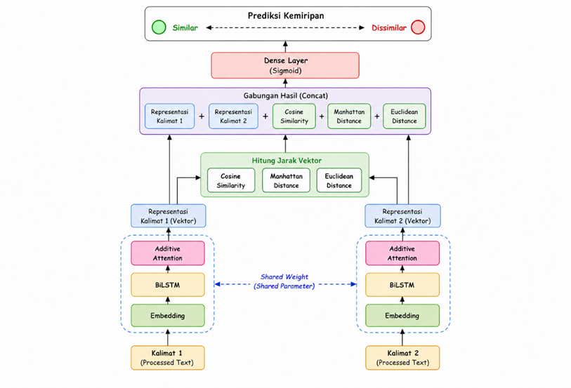
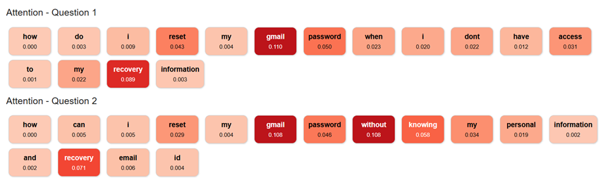

<h1 align="center">Semantic Similarity with Attention</h1>

<p align="center">
  <em>A Siamese BiLSTM encoder with additive attention pooling and multi-metric distance fusion for sentence-pair semantic matching.</em>
</p>

<p align="center">
  
  
  
  
</p>

---

## TL;DR

Two sentences can mean the same thing while sharing almost no words:

```text
A: "How do I reset my password?"
B: "I forgot my password. How can I change it?"
```

Lexical overlap says *different*; intent says *same*. This project closes that gap with a Siamese network that (1) encodes each sentence with a shared **BiLSTM + additive attention pooling** layer, and (2) compares the two resulting vectors through **three complementary distance geometries at once** — angular (cosine), city-block (Manhattan), and straight-line (Euclidean) — concatenating them with the embeddings and letting an MLP learn the decision boundary.

**The claim under test:** a single distance metric discards information. Direction and magnitude are different signals, and giving the classifier all three costs ~0 parameters while measurably improving separation.

---

## 1. Architecture

<p align="center">
  
</p>

<p align="center"><em>Figure 1 — Proposed model architecture.</em></p>

```text
q1 (70 tokens) ──┐                                              ┌──► v1 (512) ──┐
                 ├─► Embedding (frozen, pretrained) ─► BiLSTM ──┤               ├─► d_cos, d_man, d_euc
q2 (70 tokens) ──┘   shared weights          256 units, shared  └──► v2 (512) ──┘        │
                                             return_sequences                            │
                                                     │                                   │
                                          Additive Attention (64)  ◄───────────────┐     │
                                          shared, sequence → vector                │     │
                                                                                   ▼     ▼
                                              Concat [ v1 ‖ v2 ‖ d_cos ‖ d_man ‖ d_euc ]  (1027)
                                                                  ↓
                                              Dense 64 → Dropout 0.3 → Dense 32 → Dropout 0.3
                                                                  ↓
                                                      Dense 1, sigmoid → P(similar)
```

Every component — embedding, BiLSTM, attention — is **shared** between the two branches. That is what makes the network Siamese: both sentences are projected by the *same* function into a single comparable space, so the distances computed downstream are meaningful.

### Configuration

| Component | Setting |
| :--- | :--- |
| Sequence length | 70 tokens (padded/truncated) |
| Embedding | Pretrained matrix, **frozen** (`trainable=False`) |
| Encoder | `Bidirectional(LSTM(256, return_sequences=True))` → 512-d per token |
| Attention | Additive (Bahdanau), 64 hidden units → 512-d sentence vector |
| Fusion input | `[v1 ‖ v2 ‖ d_cos ‖ d_man ‖ d_euc]` → 1027-d |
| Classifier | Dense 64 (ReLU) → Dropout 0.3 → Dense 32 (ReLU) → Dropout 0.3 → Dense 1 (sigmoid) |
| Loss / Optimizer | Binary cross-entropy / Adam, lr = 1e-4 |

Freezing the embedding is a deliberate trade: the model cannot adapt word vectors to the task, but it also cannot overfit them, and every trainable parameter goes into the encoder and the comparison head instead.

---

## 2. Additive Attention Pooling

The BiLSTM emits one hidden state per token, $H = [h_1, \ldots, h_T]$ with $h_t \in \mathbb{R}^{512}$. A sentence-level decision needs a single vector, so the sequence must be collapsed. Mean-pooling would weight a stopword the same as the head noun; this layer learns the weights instead.

**Additive (Bahdanau-style) attention** scores each token, normalises the scores over time, and returns their weighted sum:

$$
e_t = v^{\top} \tanh(W h_t + b)
$$

$$
\alpha_t = \frac{\exp(e_t)}{\sum_{j=1}^{T} \exp(e_j)}
$$

$$
c = \sum_{t=1}^{T} \alpha_t \, h_t
$$

| Symbol | Shape | Role |
| :--- | :--- | :--- |
| $h_t$ | $\mathbb{R}^{512}$ | BiLSTM hidden state at position $t$ |
| $W, b$ | $\mathbb{R}^{512 \times 64}$, $\mathbb{R}^{64}$ | Projects each token into the attention space |
| $v$ | $\mathbb{R}^{64}$ | **Learned global query** — a single vector, shared across all sentences |
| $\alpha_t$ | scalar | Relevance of token $t$; $\sum_t \alpha_t = 1$ |
| $c$ | $\mathbb{R}^{512}$ | Sentence representation |

### What this mechanism is — and is not

The vector $v$ acts as one learned query asking the same question of every sentence: *which tokens carry the meaning?* Each token is scored **independently** against that query.

This matters for how results are interpreted, because it makes the layer fundamentally different from the Transformer's scaled dot-product attention:

| | Additive attention pooling (this model) | Scaled dot-product self-attention |
| :--- | :--- | :--- |
| Query source | One learned vector $v$, fixed for all inputs | Every token queries every other token |
| Output per input | One weight per token → vector $\alpha \in \mathbb{R}^{T}$ | One weight per token *pair* → matrix $\mathbb{R}^{T \times T}$ |
| Models token↔token interaction | No | Yes |
| Role in the network | Learned pooling (replaces mean/max) | Contextual re-encoding |
| Parameters | $512 \times 64 + 64 + 64 + 1 = 32{,}897$ | $4 d^2$ per layer (Q, K, V, O) |

The consequence: **attention output here is a 1-D vector of token importances, not a token×token matrix.** It should be visualised as highlighted text or a bar strip over the sentence — a square heatmap would be misleading, because this layer never computes a token-to-token score.

---

## 3. Distance Fusion

Given the two pooled representations $u = v_1$ and $w = v_2$, the model computes three distances. **All three are distances, not similarities — lower means more similar in every case**, which keeps the sign convention consistent for the classifier.

### 3.1 Cosine distance — *direction*

$$
d_{\cos}(u,w) = 1 - \frac{u \cdot w}{\lVert u \rVert \, \lVert w \rVert}
$$

Angular disagreement between the two vectors, invariant to their magnitude. Bounded in $[0, 2]$, which makes it stable, but blind to *how strongly* a feature is expressed.

### 3.2 Manhattan distance — *per-dimension disagreement*

$$
d_{\text{man}}(u,w) = \log\!\left(1 + \sum_{i=1}^{512} \lvert u_i - w_i \rvert\right)
$$

The sum of absolute differences. Because it never squares the residuals, it stays sensitive to *many small* mismatches rather than being dominated by one large one.

### 3.3 Euclidean distance — *overall displacement*

$$
d_{\text{euc}}(u,w) = \log\!\left(1 + \sqrt{\sum_{i=1}^{512} (u_i - w_i)^2 + \varepsilon}\right), \qquad \varepsilon = 10^{-8}
$$

Straight-line geometric distance. Squaring makes it Manhattan's opposite in temperament: a single badly mismatched dimension dominates the score. The $\varepsilon$ term keeps the gradient of $\sqrt{\cdot}$ finite when the two vectors coincide — without it, identical sentences produce `NaN` during backpropagation.

### Why the logarithm

Raw L1 distance over 512 dimensions can reach the hundreds while cosine distance never exceeds 2. Fed into the same Dense layer, the unscaled distances would dominate purely through magnitude. The $\log(1+d)$ transform compresses them onto a comparable range and is monotonic, so the ordering the metric encodes is preserved exactly.

### 3.4 Fusion and prediction

$$
m = \left[\, v_1 \;\Vert\; v_2 \;\Vert\; d_{\cos} \;\Vert\; d_{\text{man}} \;\Vert\; d_{\text{euc}} \,\right] \in \mathbb{R}^{1027}
$$

$$
\hat{y} = \sigma\Big(W_3 \cdot \text{drop}\big(\text{ReLU}(W_2 \cdot \text{drop}(\text{ReLU}(W_1 m)))\big)\Big)
$$

The MLP is free to learn how much to trust each geometry, rather than having fixed weights imposed by hand.

| Distance | Sensitive to | Cost |
| :--- | :--- | ---: |
| Cosine | Orientation only | 0 params |
| Manhattan | Many small differences | 0 params |
| Euclidean | A few large differences | 0 params |

All three are parameter-free Lambda operations. The entire fusion hypothesis costs **3 extra input features and zero weights** — which is precisely what makes it worth testing.

---

## 4. Results

### 4.1 Baseline Comparison

| Model | Trainable Params | Accuracy | Precision | Recall | F1 | ROC-AUC |
| :--- | ---: | ---: | ---: | ---: | ---: | ---: |
| Baseline | `XX,XXX` | `XX.XX%` | `XX.XX%` | `XX.XX%` | `XX.XX%` | `XX.XX` |
| **Proposed (BiLSTM + Attention + Fusion)** | **`XX,XXX`** | **`XX.XX%`** | **`XX.XX%`** | **`XX.XX%`** | **`XX.XX%`** | **`XX.XX`** |

<p align="center">
  
</p>

<p align="center"><em>Figure 2 — Baseline vs. proposed model across all metrics.</em></p>

> **Note.** Keras `compile()` reports accuracy, precision and recall directly; **F1 and ROC-AUC are not logged by default**. Compute F1 as the harmonic mean $2PR/(P+R)$ and ROC-AUC with `sklearn.metrics.roc_auc_score` on the sigmoid outputs.

### 4.2 Training Dynamics

<p align="center">
  
</p>

<p align="center"><em>Figure 3 — Training and validation loss across epochs.</em></p>

Read for convergence speed, the train–validation gap (overfitting), plateau height (underfitting), and step-to-step stability. With `lr = 1e-4` and a frozen embedding, expect slow but smooth convergence — a curve still descending at the final epoch means the budget, not the architecture, was the limit.

### 4.3 Discrimination — ROC-AUC

<p align="center">
  
</p>

<p align="center"><em>Figure 4 — ROC curve and AUC.</em></p>

ROC-AUC is the headline metric: it is threshold-independent, so it measures ranking quality — how reliably any similar pair scores above any dissimilar pair — rather than performance at one arbitrary cut-off of 0.5.

### 4.4 Model Complexity

```python
model.summary()
trainable = sum(w.numpy().size for w in model.trainable_weights)
```

Parameter budget by component (embedding excluded — it is frozen):

| Component | Trainable Parameters |
| :--- | ---: |
| Bidirectional LSTM (256) | `XXX,XXX` |
| Additive Attention (64) | 32,897 |
| Classifier head (1027 → 64 → 32 → 1) | 67,905 |
| Distance layers | 0 |
| **Total** | **`X,XXX,XXX`** |

The BiLSTM dominates: the attention and fusion machinery together account for a small fraction of the model. The number worth reporting is therefore **accuracy gained per parameter added** — a large gain from a small delta is the result to claim.

### 4.5 Interpretability — Attention Weights

<p align="center">
  
</p>

<p align="center"><em>Figure 5 — Learned token importances α over an example pair.</em></p>

Since $\alpha$ is one weight per token, the natural visualisation is the sentence itself with each token shaded by its weight. The diagnostic question: does the model concentrate mass on the tokens carrying shared intent (*reset* ↔ *change*, *password* ↔ *password*), or does it spread weight over stopwords and padding?

---

## 5. Key Findings

- [ ] Attention pooling outperforms mean-pooling over the same BiLSTM
- [ ] Fusing three distances beats any single-distance ablation
- [ ] The proposed model beats the baseline on F1 and ROC-AUC
- [ ] The gain justifies the added parameters
- [ ] Attention weights concentrate on semantically load-bearing tokens

> Fill each box with the measured number once experiments are final. The decisive experiment is the **ablation in §6** — without it, an improvement over the baseline cannot be attributed to the fusion rather than to the BiLSTM.

---

## 6. Planned Ablations

The concatenation feeds the classifier 1024 embedding dimensions alongside 3 distance scalars. The MLP is therefore *able* to solve the task from `[v1 ‖ v2]` alone and ignore the distances entirely. Three runs settle whether it does:

| # | Fusion input | Isolates |
| :--- | :--- | :--- |
| A | `[v1 ‖ v2]` only | Contribution of the distances |
| B | `[d_cos ‖ d_man ‖ d_euc]` only | Whether the distances are sufficient on their own |
| C | One distance at a time + `[v1 ‖ v2]` | Whether all three are needed, or one carries the gain |

If **A** matches the full model, the fusion adds nothing and the honest conclusion is that the BiLSTM encoder is doing the work. If **B** approaches the full model with ~1,000× fewer head parameters, that is the more interesting result.

---

## 7. Quick Start

```bash
git clone https://github.com/HaikalSyafie/Semantic-Similarity-NLP.git
cd Semantic-Similarity-NLP
pip install -r requirements.txt
```

```bash
# Train
python src/train.py

# Inspect attention weights
jupyter notebook notebooks/attention_visualization.ipynb
```

**Stack:** Python · TensorFlow / Keras · scikit-learn · pandas · NumPy · Matplotlib

---

## 8. Project Structure

```text
Semantic-Similarity-NLP/
│
├── Assets/                          # Figures embedded in this README
│   ├── Architecture.png
│   └── Attention.png
│
├── data/                            # Raw and processed sentence pairs
│
├── notebooks/
│   ├── training.ipynb
│   └── attention_visualization.ipynb
│
├── src/
│   ├── model.py                     # AdditiveAttention, build_proposed, build_baseline
│   ├── dataset.py                   # Tokenization, padding, embedding matrix
│   └── train.py                     # Training and evaluation loop
│
├── models/                          # Saved checkpoints (.keras)
│
├── results/
│   ├── training/training_curve.png
│   └── evaluation/
│       ├── roc_auc.png
│       └── model_comparison.png
│
├── requirements.txt
└── README.md
```

---

## 9. Roadmap

| Priority | Item |
| :--- | :--- |
| High | Run the §6 ablations to isolate the fusion contribution |
| High | Mask padding inside the attention softmax (see implementation notes) |
| High | Make the pair encoding order-invariant — `[\|v1−v2\| ‖ v1⊙v2]` instead of raw concat |
| Medium | Compare BiLSTM against the BiGRU variant at matched parameter count |
| Medium | Unfreeze the embedding for the final epochs and measure the effect |
| Medium | Sweep attention units and sequence length |
| Low | Inference optimisation — quantization, TFLite / ONNX export |
| Low | Serve the model as a FastAPI REST endpoint |

---

<p align="center">
  <sub>Built by <a href="https://github.com/HaikalSyafie">Haikal Syafie</a></sub>
</p>
